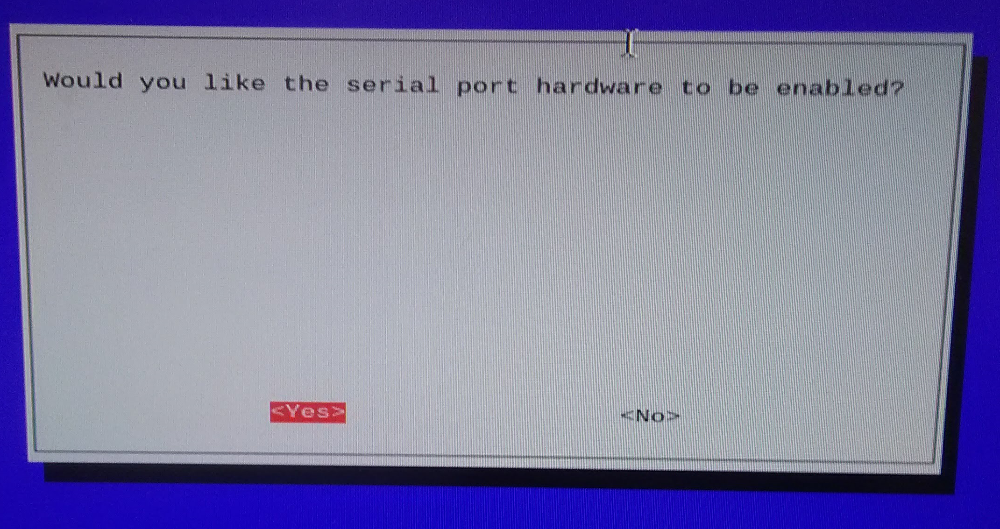

<html lang="en">
  <head>
    <meta charset="utf-8">
    <meta http-equiv="X-UA-Compatible" content="IE=edge">
    <meta name="viewport" content="width=device-width, initial-scale=1">
    <!-- The above 3 meta tags *must* come first in the head; any other head content must come *after* these tags -->
    <meta name="description" content="">
    <meta name="author" content="">

    <title>Starter Template for Bootstrap</title>

    <!-- Bootstrap core CSS -->
    <link href="dist/css/bootstrap.min.css" rel="stylesheet">

    <!-- IE10 viewport hack for Surface/desktop Windows 8 bug -->
    <!-- <link href="../../assets/css/ie10-viewport-bug-workaround.css" rel="stylesheet"> -->

    <!-- Custom styles for this template -->
    <link href="starter-template.css" rel="stylesheet">

    <!-- Just for debugging purposes. Don't actually copy these 2 lines! -->
    <!--[if lt IE 9]><![endif]-->
    <!--  -->

    <!-- HTML5 shim and Respond.js for IE8 support of HTML5 elements and media queries -->
    <!--[if lt IE 9]>
      
      
    <![endif]-->
  </head>

  <body>

    <nav class="navbar navbar-inverse navbar-fixed-top">
      

        

          <h1>Corn Drone - Aerial Crop Monitoring System </h1>
          
Sun Lab  A Project By Jane Doe.

        

            <li class="active"><a href="#">Home</a></li>
            <li><a href="#intro">Introduction</a></li>
            <li><a href="#obj">Project Objective</a></li>
            <li><a href="#hard_design">Hardware Design</a></li>
            <li><a href="#sys_setup">System Setup</a></li>
            <ul>
               <li><a href="#comm_setup">Communication Setup</a></li>
            </ul>
            <li><a href="#soft_design">Software Design</a></li>
            <li><a href="#testing">Final Integration and Testing</a></li>
            <li><a href="#futurework">Future Work</a></li>
      

    </nav>
    

      

      

       
      <iframe width="640" height="360" 
      src="https://www.youtube.com/watch?v=liCTpQmD1XQ&feature=youtu.be" frameborder="0" allowfullscreen>
      </iframe>
      <h4 style="text-align:center;">Demonstration Video</h4>
      

      

      

              <h2>Introduction</h2>
              
Quick and reliable detection of plant performance is one extremely crucial tool for agriculturists and researchers of plant sciences. In most cases this requires manual investigation of the crop by physically checking each plant making the process long, cumbersome and prone to human error. This is especially difficult when tall crops like corn are grown in large fields. Optimization of this process would allow farmers to be more aware of the crop quality and be able to implement changes more promptly increasing economic yield and reducing wastage of resources. Researchers have found that when a particular plant is struggling it reflects wavelengths from across the spectrum which are different from their thriving counterparts. Dynamic monitoring of these differences will help obtain plant distress signals. By using a spectrometer coupled with a drone, communicating with the help of a raspberry Pi we present a method of aerial data collection for faster, accurate and large scale detection of plant distress and enhance plant monitoring.

      

    

  
    

             <h2>Project Objectives</h2>
             

                

                    
                

                

                    <ul>
                      <li>Gathering hyperspectral data at predetermined points on a corn field with the help of an autonomous unmanned aerial vehicle (UAV).</li>
                      <li>Set up robust communications between the UAV, the spectrometer and the RPi to enable flight over extended distances without delay or loss of network.</li>
                      <li>Interfacing the spectrometer with the RPi to procure and plot crucial data of wavelength reflections from each crop region for detection of plant distress signals.<li>
                    </ul>
                
 
             

    

    

      

              <h2>Hardware Design</h2>
              
The components used for this project are:
                

                  <ol>
                    <li>Flame Spectrometer - This is an Ocean Optics product that is design to sustain thermal variance with minimal data error. This spectrometer combined with a fibre optic cable we can detect the reflected wavelengths from the corn fields at a specific location.</li>
                    <li>3DR Solo Pixhawk Drone - This is the UAV that we use for flying the payload comprising of the spectrometer, the Raspberry Pi and its power source to points on the field, arriving at which it will hover and allow the Flame Spectrometer to collect data before moving to a new location. This can be driven manually or by setting up a flight plan for autonomous drone movement.</li>
                    <li>Raspberry Pi 3 - This is the center of communication flow and provides a place for storing the collected data. This contains the programs for procuring signals from the drone and signal the Flame Spectrometer to commence its data collection. The data is either stored in its own File System or to an external pen drive if it is attached.</li>
                    <li>3DR Handheld Drone Controller - This is the 3DR Solo Drone controller that is used to calibrate the drone for GPS and leveling. This can be used to manually fly the drone to any specific location, regain control of the drone from autonomous flight and also for broadcasting a local wifi hotspot.</li>
                  </ol>
                 

              

      

 

    

    

            <h2>System Setup</h2>
    

    
    

    

            <h2>Communication Setup</h2>
            

                

                 
                We used three different approaches to setup communication between the Pixhawk and the RPi. The Pixhawk is the flight controller hardware embedded in the drone that contains ARM processor, sensors, power system control, and communication interfaces such as serial ports, I2C, USB and SPI. 
                 
                Step 1: Turnoff serial console 
                 
                Before we started the communication setup, we turned off the serial console in the RPI. The serial console allows us to connect between other computers and the RPi to access the linux console that displays system settings during boot. This is important to check and fix problems during boot or while logging onto the RPi. If this is not turned off it can interfere with the signal that is sent between the RPi and the drone. It is important to note that we only disabled the setting that allows the login shell to be accessible over seria; the serial hardware communication is not disabled. 
                 
                The serial console can be turned off in two ways:
                 
                1. Using raspi-config:
                <ul>
                  <li> Type raspi-config in the console</li>
                  <li> Go down to advanced options and hit enter</li>
                  <li> Go down to Serial and hit enter</li>
                  <li> You will be asked the first question below and select No</li>
                  <li> Select Yes for the second question</li>
                </ul>
                2. From desktop:
                 
                From the desktop screen click on the RPi logo, click on Preferences and then select RaspberyPi configuration. Select disable button for Serial. 
                 
                Step 2: Setup communication:
                 
                1. Tx/RX serial communication port
                 
                Our first approach was to setup a serial communication between drone and RPi. Since the Pixhawk is inside the drone we used a breakout board to access the pins from outside. 
                 
                The TX/RX pins of the RPi were connected to RX/TX pins of the breakout board respectively. This allows us to transmit data between the drone and the RPi. The baud rate ( the rate in which signals are signals are transmitted) the the communication on the RPi should be set to 57600 since the Pixhawk transmits signals at this rate. In addition, it is also important to ensure that there is a common ground between RPi and Pixhawk.
                 
                Once the hardware connections are setup correctly, the next step is to test if signals can be transmitted between the two devices.  In order to connect them we used Mavproxy software. The baud rate is set to 57600. The teletypewriter (tty) is USB0. --master specifies which port (serial, USB or network address/port) the UAV is communicating on. --baudrate specifies the baud rate and finally --aircraft specified the directory in which the log files for the drone are created. The Mavproxy software is run as a root user; therefore sudo -s should be used to switch from pi user to root user. 
                 
                sudo -s
                 
                mavproxy.py --master=/dev/ttyS0 --baudrate 57600 --aircraft MyCopter
                 
                However this step didn’t work. In fact, we got a console message that the link between the two was “OK” when the common ground pins were disconnected. Otherwise it displays “Waiting for heartbeat” message. Heartbeat is a periodic signal that can be transmitted between devices. Typing “link” on the console once Mavproxy is running can show whether or not the link is ok. 
                 
                We are not fully certain as to why the common ground issue gives error. However, at some point, we took apart the entire drone noticed that even though the breakout board is connected directly, the ground pins indicated on the breakout board do not go to the Pixhawk. We alternated between different ground pins and tested the connection, but this didn’t make a difference. Therefore, we switched to using another form of communication. 
                 
                2. Universal serial port (USB):
                 
                Instead of using the TX/RX pins on the breakout board and RPi, we connected connected a USB port to the RPi and the corresponding power, ground, Data+ (D+) and Data-(D-) pins on the breakout board. We tested the connection using a different tty. However, still the communication didn’t work. There was also a common ground issue in this communication. 
                 
                mavproxy.py --master=/dev/ttyUSB0 --baudrate 57600 --aircraft MyCopter
                 
                3. Direct connection with Pixhawk
                  
                At this point we decided to take apart the drone and access the Pins directly. When we took it apart, we found out that there is a  microsub pin. Therefore, we planned on setting up a direct micro usb-usb connection between the raspberry pi and the pixhawk. 
                 
                Before doing that we installed another ground control station (GCS) software that other people normally use on their laptops to connect with the drone. We installed Mission Planner and APM Planner 2.0 softwares. Both have similar configurations and for later steps during the project we mostly used Mission Planner. 
                 
                This software enables us to directly connect the drone with our laptop using a COM (communication) port through the USB. We were able to connect the drone. 
                 
                At this point we found out that we had to do software updates and calibrations for the drone before even checking the communication since the drone won’t be able to fly unless clibrations are done properly. Therefore, we took a step back and worked on updating the builtin software in the drone. However, in order test the communication only updates were necessary.  
                 
                Once the software is updated , we were also able to connect between the RPi and the drone using the same microsub-usb configuration. 
                    
                We thought this step would be our final connection method with the drone. However, we found out that this communication only works as long as the drone is turned off since the Pixhawk can be powered from the RPi. This could be a result of the drone preventing double powering of the controller(Pixhawk). One way to avoid this could be stripping the wire that has micro usb and usb  ports on either ends and cutting the power line. However, we decided to move try another alternative that we thought would work after testing the drone in the field. 
                 
                4. Sololink wifi
                 
                The way we connected with the drone from our laptop during field test was by using the wifi broadcasted from the controller. The drone controller has both radio and wifi signals that can allow it to control the drone over longer distances. In order to do this we used  a UDP connection from mission planner. After having done the field test and encountering the double powering issue of the micro usb usb connection, we decided to test similar form of connection from the RPi using Mavproxy since it is also a GCS software except that it is console based. 
                 
                In order to do this we first connected the RPi wifi to the wifi broadcasted from the controller (Sololink) and then accessed the wlan address by typing ifconfig  command from the console. We added this network address in the master command as shown below.  
                 
                mavproxy.py --master=udp:10.1.1.152:14550 --baudrate 57600 --aircraft MyCopter
                 
                The universal datagram protocol (UDP) is a communication protocol that transfers short data packets called datagrams. This communication worked well for our test. The UDP address can also be modified depending on the wlan address. However, since the RPi will be flying with the drone, the RPi will lose communication with the controller and thus the drone if the drone flies further. The drone is able to communicate with the controller over longer distances since it can use radio communication if the wifi signal is not strong enough. Therefore, it may be necessary to switch to the direct micro usb - usb connection for the actual implementation of the project in the corn field. 
                 
                We also tested this communication using Dronekit software which also worked when we used connect command with the right udp (wlan) address. 
                 
                # Connect to the Vehicle (in this case a UDP endpoint)
                 
                vehicle = connect('10.1.1.152:14550', wait_ready=True)
                 
              

        

    

      

              <h2>Software Design</h2>
              
Lorem ipsum dolor sit amet, consectetur adipiscing elit. Vestibulum lorem nulla, consectetur at leo vel, pretium bibendum nisl. Cras blandit quam a enim ultrices, eu convallis enim posuere. Donec eleifend enim sed purus consectetur, vitae cursus lectus varius. Vivamus consectetur felis nec est venenatis posuere. Phasellus vitae aliquet erat. In laoreet lacinia mollis. Quisque iaculis nisl fermentum pharetra lobortis. Donec rhoncus dui sem, ac molestie leo tristique vel. Phasellus in nibh feugiat, fringilla lectus in, elementum magna. Etiam quis dui condimentum, tempus ex in, dapibus est. Cras ut congue augue. Donec ac enim ex. Ut id tristique risus, vel porttitor quam. Sed ultricies enim eu nibh porttitor, vel sodales enim feugiat. Fusce volutpat venenatis magna ac ultrices. Curabitur eget urna ut nulla mattis convallis non eu diam.

      

    

      

              <h2>Final Integration and Testing</h2>
              
Lorem ipsum dolor sit amet, consectetur adipiscing elit. Vestibulum lorem nulla, consectetur at leo vel, pretium bibendum nisl. Cras blandit quam a enim ultrices, eu convallis enim posuere. Donec eleifend enim sed purus consectetur, vitae cursus lectus varius. Vivamus consectetur felis nec est venenatis posuere. Phasellus vitae aliquet erat. In laoreet lacinia mollis. Quisque iaculis nisl fermentum pharetra lobortis. Donec rhoncus dui sem, ac molestie leo tristique vel. Phasellus in nibh feugiat, fringilla lectus in, elementum magna. Etiam quis dui condimentum, tempus ex in, dapibus est. Cras ut congue augue. Donec ac enim ex. Ut id tristique risus, vel porttitor quam. Sed ultricies enim eu nibh porttitor, vel sodales enim feugiat. Fusce volutpat venenatis magna ac ultrices. Curabitur eget urna ut nulla mattis convallis non eu diam.

      

    

      

              <h2>Future Work</h2>
              
Lorem ipsum dolor sit amet, consectetur adipiscing elit. Vestibulum lorem nulla, consectetur at leo vel, pretium bibendum nisl. Cras blandit quam a enim ultrices, eu convallis enim posuere. Donec eleifend enim sed purus consectetur, vitae cursus lectus varius. Vivamus consectetur felis nec est venenatis posuere. Phasellus vitae aliquet erat. In laoreet lacinia mollis. Quisque iaculis nisl fermentum pharetra lobortis. Donec rhoncus dui sem, ac molestie leo tristique vel. Phasellus in nibh feugiat, fringilla lectus in, elementum magna. Etiam quis dui condimentum, tempus ex in, dapibus est. Cras ut congue augue. Donec ac enim ex. Ut id tristique risus, vel porttitor quam. Sed ultricies enim eu nibh porttitor, vel sodales enim feugiat. Fusce volutpat venenatis magna ac ultrices. Curabitur eget urna ut nulla mattis convallis non eu diam.

      

    

    

          <h2>Work Distribution</h2>
          

              
              <h4>Project group picture</h4>
          

          

              
              <h3>Rick</h3>
              
netid@cornell.edu

              
Designed the overall software architecture (Just being himself).
          

          

              
              <h3>Morty</h3>
              
netid@cornell.edu

              
Tested the overall system.
          

      

    

      

          <h2>Parts List</h2>
          <ul>
              <li>Raspberry Pi $35.00</li>
              <li>Raspberry Pi Camera V2 $25.00</li>
              <a href="https://www.adafruit.com/product/1463"><li>NeoPixel Ring - $9.95</li></a>
              <li>LEDs, Resistors and Wires - Provided in lab</li>
          </ul>
          <h3>Total: $69.95</h3>
      

      

      

          <h2>References</h2>
          <a href="https://picamera.readthedocs.io/">PiCamera Document</a> 
          <a href="http://www.micropik.com/PDF/SG90Servo.pdf">Tower Pro Servo Datasheet</a> 
          <a href="http://getbootstrap.com/">Bootstrap</a> 
          <a href="http://abyz.co.uk/rpi/pigpio/">Pigpio Library</a> 
          <a href="https://sourceforge.net/p/raspberry-gpio-python/wiki/Home/">R-Pi GPIO Document</a> 

      

    

      

              <h2>Code Appendix</h2>
              <pre><code>
             // Hello World.c
int main(){
  printf("Hello World.\n");
}
              </code></pre>
      

    
<!-- /.container -->

    <!-- Bootstrap core JavaScript
    ================================================== -->
    <!-- Placed at the end of the document so the pages load faster -->
    
    
    
    <!-- IE10 viewport hack for Surface/desktop Windows 8 bug -->
    <!--  -->
  </body>
</html>

